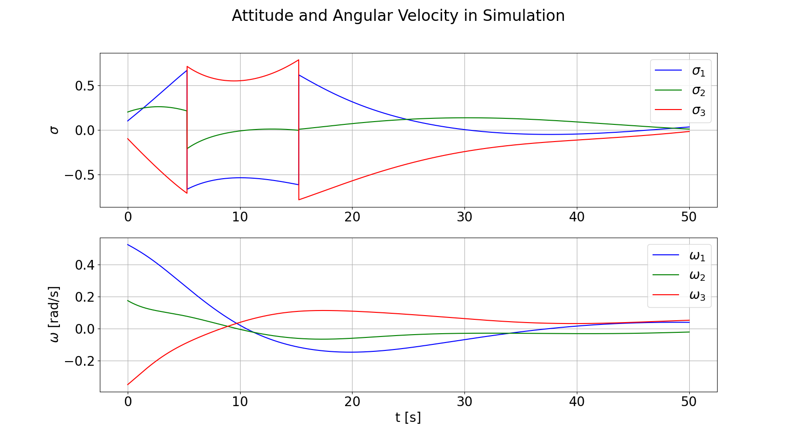
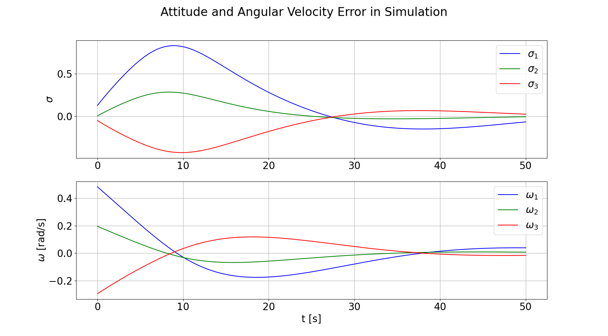
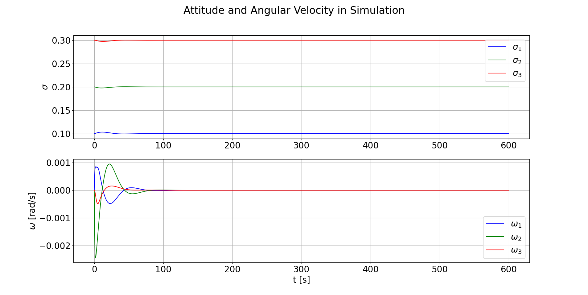
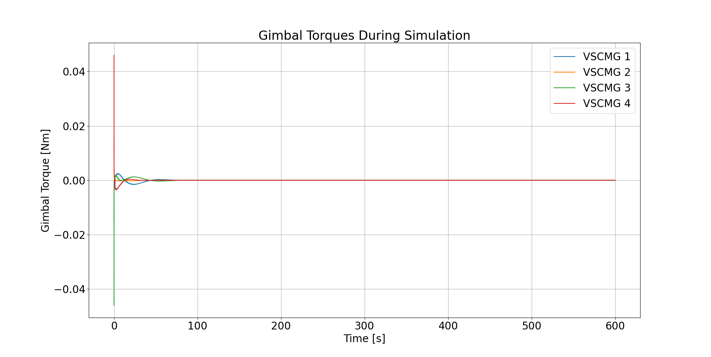
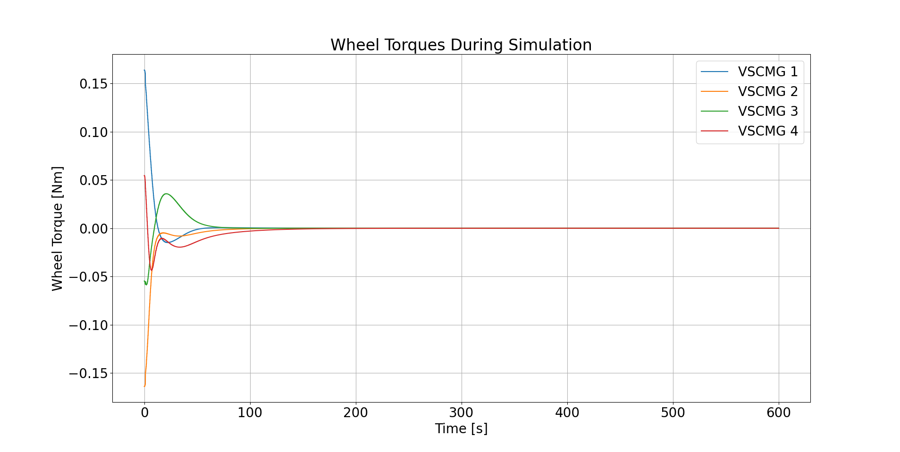

# Spacecraft Dynamics
A Python package developed from various courses, assignments and projects.

## Features
- Modeling of satellite attitude dynamics
- Support for various kinds of actuators
    - Reaction wheels
    - Variable-Speed Control Moment Gyroscopes (VSCMGs)
    - None (control authority is assumed)
- Support for different control algorithms
- Support for different guidance algorithms
- Relative motion dynamics modeling (for formation flying and collision avoidance uses)

## Coming Soon
- Guidance algorithms as the primary interface to the satellite (this is how most 
3rd party software uses an ADCS!)
- Combining orbit propagation and formation flying dynamics with rotational dynamics
    - Currently these things are somewhat decoupled (a full pos/vel/att/angVel sim can be constructed right now but it'd be annoying)
    - Some of the example scenarios fake orbit prop by converting propagating spherical coordinates over 
    time and converting them to cartesian (no equations of motion are actually modeled though)

## Installation
This package is not on PyPI but you can install it directly from the repository:

```bash
# Clone the repository
git clone https://github.com/Jmiceli17/spacecraft_dynamics.git
cd spacecraft_dynamics

# Upgrade setuptools to support editable installs
pip install --upgrade setuptools>=64.0

# Option 1: Install directly
pip install .

# Option 2: Install in development mode (if you want to modify the code)
pip install -e .
```

## Documentation
See https://github.com/Jmiceli17/spacecraft_dynamics/tree/main/docs for this package's current documentation.

## Examples

See the `examples/` directory for usage examples:
- Attitude control simulations
- Actuator configurations
- Orbital scenarios
- Scripts that demonstrate how to use certain classes and utility functions (developed for various quizzes and homeworks)


```bash
# Example usage
cd spacecraft_dynamics/examples
python mission-simulation.py
```

> **Note:** If running in WSL2, you may need to:
> 1. Install and start [XLaunch/VcXsrv](https://sourceforge.net/projects/vcxsrv/) (or some other X-server)
> 2. Set the `DISPLAY` environment variable: `export DISPLAY=:0` (or `export DISPLAY=$(cat /etc/resolv.conf | grep nameserver | awk '{print $2}'):0` for WSL2)
> 3. Ensure tkinter is available: `conda install tk` or `apt-get install python3-tk` (if using system Python)
> 
> The plotting code will automatically detect if a display is available and use an appropriate backend.

### Example Visualizations

<div align="center">

#### Attitude Reference Tracking




#### Attitude Control Simulation with VSCMG Null Motion 









</div>


## Package Structure

```
spacecraft_dynamics/
├── src/spacecraft_dynamics/
│   ├── actuators/      # Reaction wheels, VSCMGs
│   ├── control/        # Control algorithms
│   ├── core/           # Core spacecraft models
│   ├── guidance/       # Guidance algorithms
│   ├── orbit/          # Orbital dynamics
│   ├── state/          # State representations
│   ├── utils/          # Utility functions
│   └── analysis/       # Plotting and analysis tools
├── examples/           # Example simulations
└── docs/               # Documentation
```

## Development

For development, clone the repository and create a conda (recommended) environment:

```bash
git clone https://github.com/Jmiceli17/spacecraft_dynamics.git
cd spacecraft_dynamics
conda env create -f environment.yml
conda activate sc-dyn

# Upgrade setuptools to support editable installs (PEP 660)
pip install --upgrade setuptools>=64.0

pip install -e .
```


## License
This project is licensed under the MIT License - see the [LICENSE](LICENSE) file for details.
